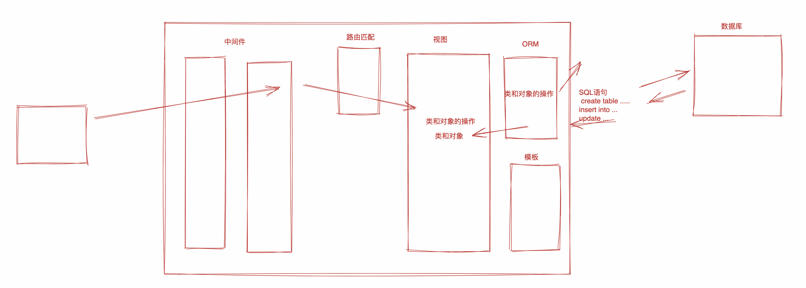

# Django

## 安装

~~~python
pip install django==3.2
~~~

## 命令行

- 创建项目

~~~python
cd 指定目录
django-admin startproject 项目名
~~~

- 运行

~~~00
cd 项目
python manage.py runserver
python manage.py runserver 127.0.0.1:9000
~~~

## App

- 创建app

~~~python
python manage.py startapp 项目的名字
python manage.py startapp web apps/web # 指定文件执行操作
~~~

## 虚拟环境

- venv,python官方用于创建虚拟环境的工具

~~~python
# 创建名为 "ddd" 的虚拟环境
python -m venv ddd
~~~

- virtualenv [推荐]

~~~python
pip install virtualenv
~~~

~~~python
cd /xxx/xx/
virtualenv ddd -python=python3.9
~~~

~~~python
virtualenv /xxx/xx/ddd --python=python3.7
~~~


操作

- 在`F:\envs\`创建虚拟环境

~~~python
cd F:\envs
virtualenv crm --python=python3.9
~~~

- 激活虚拟环境

  - win

  ~~~python
  cd F:\envs\crm\script
  activate
  ~~~

- 安装包

~~~python
pip install 包名
~~~

- 创建django项目 `D:\project\crm`

~~~python
cd D:\project
django-admin startproject crm
~~~

~~~python
python manage.py startapp xxxx
python manage,py runserver
~~~

- 退出虚拟环境

~~~
deactivate
~~~

## 多app应用的层级分布

~~~python
day002
	.venv
    day002
    	...
        ...
     manage.py
    apps
    	web
        backend
        api
~~~

## 路由
- 在app中的view配置

~~~python
from django.http import HttpResponse


# Create your views here.
def web(request):
    return HttpResponse("成功")

def news(request, nid):
    print(nid)
    return HttpResponse(f"新闻 ID: {nid}")

~~~

- 在最高url配置

~~~python
from django.contrib import admin
from django.urls import path
from apps.web import views
urlpatterns = [
    path('home/',views.web),
    # http://localhost:8000/home/
    path("news/<int:nid>/",views.news)
    # http://localhost:8000/news/12/
]
~~~

- int 整数
- str 字符串 /
- slug 字母 + 数字 + 下划线
- uuid uuid格式
- path 路径 , 可以包含 / 

### 路由正则表达式(一一对应)

- 视图部分

~~~python
def user(request,xid):
    print(xid)
    return  HttpResponse(f"新闻 ID: {xid}")

def user(request,xid,yid):
    print(xid,yid)
    return  HttpResponse(f"新闻 ID: {xid}")
~~~

- 路由部分

~~~python
from django.urls import re_path
re_path(r'user/(\d+)/',views.user)

re_path(r'users/(\w+-\d+)/d+)/',views.user)

re_path(r'users/(?P<xid>\w+-\d+)/(?P<yid>\d+)/',views.user)
~~~

### 路由分发

- 路径分发(正则也同理在组件路由中)

- 主路由配置

~~~python
from django.urls import path,include

urlpatterns = [
    path('api/', include("apps.web.urls"))
]
~~~

- 组件路由配置(手动生成urls.py文件)

~~~python
from django.urls import path
from apps.web import  views
urlpatterns = [
    path('auto/', views.web)
]
~~~

### 手动做路由分发

- 自定义长路由

~~~python
path('user/api',views.user)
path('user/',([
    path('delet/',views.user)
              ],None,None))
帮我我们提取url 防止重复编写
~~~

### 路由名字(name)

~~~python
urlpatterns = [
    path('/login',views.web,name="v1")
]
~~~

有了名字后,以后一般有两处会用到

- 在视图中会用到

~~~python
urlpatterns = [
    path('login/',views.web,name="v1"),
    path('login2/',views.webs,name="v2")
]
~~~

- HTML模版 页面上有一个a标签 添加xx

~~~html
<a href="/xx/xx/xx">添加</a>
~~~

~~~html
<a href=""添加></a>
~~~

- 扩展

~~~python
以后做权限管理 让name属性配合
# 视图部分
def webs(request,role):

    url = reverse("v1",kwargs={"role":"hhh"})
    # /login/hhh/
    return HttpResponse("login")

# 路由部分
urlpatterns = [
    path('login/<str:role>',views.web,name="v1"),
    path(r'login2/(\d+)/(w+)/',views.webs,name="v2")
]

~~~


#### 重定向

- 视图

~~~python
def webs(request):
    print("login")
    from django.urls import reverse
    url = reverse("v1")
    return redirect(url)

def web(request):
    return HttpResponse("成功")
~~~

- 路由

~~~python
urlpatterns = [
    path('login/',views.web,name="v1"),
    path('login2/',views.webs,name="v2")
]
~~~

### namespace

辅助name

- 主路由

~~~python

from django.urls import path,include,include
# 很多功能 很多URL
urlpatterns = [
    path('login/<str:role>',include("app.api.urls")),
    path('web/',include("app.web.urls")),
]

~~~

- 子路由

~~~python
from django.urls import path,include,re_path
from. import views
# 很多功能 很多URL
urlpatterns = [
    path('home/',views.home,name="login",namespace="x1"),
    path('auto/',views.auth,name="auth",namespace="x2")
]
~~~

~~~python
from django.urls import path,include,re_path
from. import views
# 很多功能 很多URL
urlpatterns = [
    path('login/',views.login,name="login"),
    path('order/',views.order,name="order")
]
~~~

以后再某个URL或视图中反向生成:

~~~python
from django.urls import reverse
url = reverse("x1 : login")   #api/login/ 
url = reverse("x1 : auto")   #api/login/ 

url = reverse("x2 : login")   #api/login/ 
url = reverse("x2 : order")   #api/login/ 
~~~

#### namespace扩展

- namespace需要设置app_name

~~~python
# 主路由
urlpatterns = [
    path('login/', include(("apps.web.urls", "x1"), namespace="x1")),
]

# 子路由
from django.urls import path, re_path
from apps.web import views

app_name = "login"

urlpatterns = [
    path('login/', views.web, name="login")
]

#对于子路由组的写法
from django.urls import path, include
from apps.web import views

app_name = 'x1'  # 定义应用名称

urlpatterns = [
    path('api/', include(([
        path('login/', views.web, name="login"),
    ], 'x1'))),
]
~~~

### 路由-匹配当前的对象(显示所有可以匹配的内容)

- 主路由

~~~python
urlpatterns = [
    path('login/',views.web,name="login")
]

~~~

- 视图

~~~python
def web(request):
    print(request.resolver_match)
   #  ResolverMatch(func=apps.web.views.web, args=(), kwargs={}, url_name=login, app_names=[], namespaces=[], route=login/)
    return HttpResponse("成功")

~~~

作用:

~~~python
某用户 具有一些权限 permissions = ["xx" , "login" , 'account']
某用户 具有一些权限 permissions = ["login","account"]
~~~

- 主路由

~~~python
urlpatterns = [
    path('login/',views.web,name="login")
]
~~~

~~~python
def web(request):
    # 1.获取当前用户具备的所有权限
    permissions = ["xx","login","account"]

    # 2.判断是否具有权限
    current_name = request.resolver_match.url_name
    if current_name not in permissions:
        return  HttpResponse("无权访问")

    # 3.有权访问
    
    return HttpResponse("成功")
~~~

## 视图

### 相对导入 和 绝对导入

~~~python
#相对导入
from .views import order
# 绝对导入
from apps.web import  views
# 最好用绝对导入
~~~

### 视图参数

~~~python
urlpatterns = [
    path("login/",account.login , name="login"),
]
~~~

~~~python
from django.shortcuts import HttpResponse
def login(request):
    return HttpResponse("login")
~~~

request是什么? 对象

~~~python
python对象 , 包裹 , 可以放很多东西 .
request 是一个对象 存放了浏览器给咱们发过来的所有内容
	- 请求相关所有的数据 : 当前访问的url 请求方式,....
    - django额外提供的数据 
~~~

~~~python
def web(request):
    # 当前的URL
    print(request.path_info)

    # URL传递的参数
    print(request.GET)
    # 单独获取一个参数
    print(request.GET.get())

    # 请求方式 get/post
    print(request.method)

    # 如果post请求 传递请求体(原始数据)
    print(request.body)

    # 请求体+请求头
    print(request.POST)
    print(request.POST.get("v1"))
    print(request.POST.get("v1"))

    # 请求体 + 请求投 文件
    print(request.FILES)
    print(request.FILES.get("n1"))

    # 请求头
    print(request.headers )
    request.headers['cookie']

    # cookie
    print(request.COOKIES)

    # request中其他值
    print(request.resolver_match)
    return HttpResponse("成功")
~~~

### 数据分析流程

```python
# 1, 获取请求数据
print(request)

# 2.根据请求数据进行条件的判断 GET/POST GET.get("xxx") Post.get("xxx")

# 3.返回数据

# 3.1 字符窜/字节/文本数据(图片验证码)
return HttpResponse("成功")

#3.2 json格式
data_dict = {"status":True,"data":[11,222,33]}
return JsonResponse(json.dumps(data_dict))
```

### 重定向

```python
# 3.3 重定向
return redirect("https://www.baidu.com")
```

### 渲染

~~~python
def web(request):
    # 3.4渲染
    # - a 找到'login.html' 并读取的内容 问题:去哪里找?
    # 默认先去settings.TEMPLATES.DIRS指定的路径找
    # 去每个已注册的app中找到他templates目录 去这个目录中寻找'login.html'
    return render(request,'login.html')

    # 在多app中 建议多一层文件夹包裹他
    return render(request,'web/login.html')

    # -b 渲染(替换) 得到替换完成的字符串
    # -c 返回浏览器
~~~

### 返回值(总结)

- HttpResponse
- JsonResponse
- render
- redirect

### 响应头 和 cookie

~~~python
def web(request):
    # 响应头
    res =HttpResponse("login")
    res["xxx"] = "hahahah"

    # cookie
    res.set_cookie("k1","123123123")
    return  res
~~~

### FBV 和 CBV

- FBV，视图用函数的形式编写。**（目前主流）**function base views
- CBV，视图用类的形式编写。	                 class  base views

请注意，这一些都是表象，本质一模一样。

## 静态资源

静态资源:

- 开发需要 : css js 图片

~~~python
 - 跟目录的 /static/
 - 已app目录下载 /static/文件夹下
~~~

- 媒体文件 : 用户上传的数据 (excel , 音频)

~~~python
- 根目录的 /media/
~~~

### 静态文件

~~~python
INSTALLED_APPS = [
    # 'django.contrib.admin',
    # 'django.contrib.auth',
    # 'django.contrib.contenttypes',
    # 'django.contrib.sessions',
    # 'django.contrib.messages',
    'django.contrib.staticfiles',
    "apps.web.apps.WebConfig"
]
STATIC_URL = '/static/'
STATICFILES_DIRS = [
    os.path.join(BASE_DIR, 'static'),
]
~~~

- 多app开发：各自app的图片放在各自  `/static/app名字/。。。`

- 在开发过程中

  - 禁止

    ```html
    
    ```

  - 建议

    ```html
    
    
    <!DOCTYPE html>
    <html lang="en">
    <head>
        <meta charset="UTF-8">
        <title>Title</title>
    </head>
    <body>
    <h1>登录页面</h1>
    <a href="/xxx/xxxxx/">调换dao xx</a>
    <a href="">跳转</a>
    
    
    
    </body>
    </html>
    ```

    ### 媒体文件

    - 首先要在setting.py中添加以下配置:

    ~~~python
    MEDIA_URL = '/media/'
    MEDIA_ROOT = os.path.join(BASE_DIR, 'media')
    ~~~

    - urls.py

    ```python
    from django.contrib import admin
    from django.urls import path, re_path, include
    from django.conf.urls.static import static
    from django.conf import settings
    
    from apps.api import views
    
    
    # 很多功能，很多URL
    urlpatterns = [
        path('api/', include('apps.api.urls')),
    ] + static(settings.MEDIA_URL, document_root=settings.MEDIA_ROOT)
    ```

    ~~~html
    
    ~~~

    

## 模版

寻找html模版

~~~python
TEMPLATES = [
    {
        'BACKEND': 'django.template.backends.django.DjangoTemplates',
        'DIRS': [],
        'APP_DIRS': True,
        'OPTIONS': {
            'context_processors': [
                'django.template.context_processors.debug',
                'django.template.context_processors.request',
                'django.contrib.auth.context_processors.auth',
                'django.contrib.messages.context_processors.messages',
            ],
        },
    },
]
~~~

优先去项目根目录 > 每个已注册的app的templastes目录找.


如何选择: 

- 简单的项目,模版都放在根目录
- 复杂的项目 , 模版放在各自app中 公共部分放在templastes目录

### 常用语法

- 视图

~~~python
import json

from django.http import HttpResponse
from django.shortcuts import redirect, render
from django.urls import reverse

class Person(object):
    def __init__(self,age,name):
        self.name = name
        self.age = age

    def get_data(self):
        return "哈哈哈哈哈哈"

def fetch_data():
    return "我是一个函数"

def gen_data():
    yield 123
    yield 456
    yield 789

def web(request):
    context = {
        "n1":"仙人掌",
        "n2":[11,22,33,44],
        "n3":{
            "name":"吴佩奇",
            "age":19,
        },
        'n4':[
            {"id":1,"name":"新晨1","age":18},
            {"id":2, "name": "新晨2", "age": 18},
            {"id":3, "name": "新晨3", "age": 18},
            {"id":4, "name": "新晨4", "age": 18},
        ],
        "n5":Person("江春",19),
        "n6":fetch_data(),
        "n7":gen_data
    }
    return render(request,"index.html",context)
~~~

- 模版

~~~html
<!DOCTYPE html>
<html lang="zh-CN">
<head>
    <meta charset="UTF-8">
    <meta name="viewport" content="width=device-width, initial-scale=1.0">
    <title>Django模板示例</title>
</head>
<body>
    <h1>Django模板示例</h1>

    <h2>n1 - 字符串</h2>
    <p>{{ n1 }}</p>

    <h2>n2 - 列表</h2>
    <ul>
    
        <li>{{ item }}</li>
    
    </ul>

    <h2>n3 - 字典</h2>
    <p>姓名：{{ n3.name }}</p>
    <p>年龄：{{ n3.age }}</p>

    <h2>n4 - 字典列表</h2>
    <table border="1">
        <tr>
            <th>ID</th>
            <th>姓名</th>
            <th>年龄</th>
        </tr>
        
        <tr>
            <td>{{ person.id }}</td>
            <td>{{ person.name }}</td>
            <td>{{ person.age }}</td>
        </tr>
        
    </table>

    <h2>n5 - Person对象</h2>
    <p>姓名：{{ n5.name }}</p>
    <p>年龄：{{ n5.age }}</p>
    <p>get_data方法返回：{{ n5.get_data }}</p>

    <h2>n6 - 函数返回值</h2>
    <p>{{ n6 }}</p>

    <h2>n7 - 生成器</h2>
    <ul>
    
        <li>{{ item }}</li>
    
    </ul>

</body>
</html>
~~~

### 内置模版函数

在django模版语法中提供了内置函数让我们来使用

- 视图

~~~python
context = {

    "n8":"zhangkai",
    "n9":datetime.datetime.now(),
    "n10": datetime.datetime.now().strftime("%Y-%m-%d")
}
~~~

- 模版

~~~html
    <h1>Django模板示例</h1>

    <h2>n8 - 大写|小写</h2>
    <p>{{ n8|upper }}</p>
    <p>{{ n8|lower }}</p>

    <h2>n9|n10 - 获取时间</h2>
    <p>{{n9}}</p>
    <p>{{ n9|date:"Y-m-d H:i:s" }}}</p>
    <p>{{n10}}</p>
~~~

### 自定义指定

#### 自定义filter

- 在目录下新建templatetages中再建立一个py文件

~~~python
from django import template
register = temlpate.Libaray()

@register.filter
def myfunc(value):
    return value.upper()
~~~

~~~html

<!DOCTYPE html>
<html lang="zh-CN">
<head>
    <meta charset="UTF-8">
    <meta name="viewport" content="width=device-width, initial-scale=1.0">
    <title>Django模板示例</title>
</head>
<body>
    <h1>Django模板示例</h1>

    <h2>n8 - 大写|小写</h2>
    <p>{{ n8|myfunc }}</p>


</body>
</html>
~~~

#### 自定义simple_tag

~~~python
from django import template
register = temlpate.Libaray()

@register.simple_tag
def mytag(a1,a2):
    returna a1+ "哈哈哈哈哈"+a2
    
@register.simple_tag
def mytag():
    returna "哈哈哈哈哈"    
~~~

~~~html

<!DOCTYPE html>
<html lang="zh-CN">
<head>
    <meta charset="UTF-8">
    <meta name="viewport" content="width=device-width, initial-scale=1.0">
    <title>Django模板示例</title>
</head>
<body>
    <h1>Django模板示例</h1>
    <p></p>
    <p></p>
</body>
</html>
~~~

#### 自定义inclusion_tag()

~~~python
@register.inclusion_tag("xxxxx.html")
def xxxx():
    # <h1>打开个---73</h1>
    return {"name":"大大","age":73}
~~~

- 新建一个xxxx.html文件(需要先生成一个专门对于这个注解的网页 才能使用这个注解)

~~~html
<h1>{{name}}--{{age}}</h1>
~~~

- 在最终的html片段

~~~html

<!DOCTYPE html>
<html lang="zh-CN">
<head>
    <meta charset="UTF-8">
    <meta name="viewport" content="width=device-width, initial-scale=1.0">
    <title>Django模板示例</title>
</head>
<body>
    <h1>Django模板示例</h1>
    <p></p>
</body>
</html>
~~~

#### 三种自定义注解对比

三种方式：

- filter

  ```
  - 数据处理，参数：1~2个
  - 数据处理，if条件
  ```

- simple_tag

  ```
  参数无限制 & 返回文本
  ```

- inclusion_tag

  ```
  参数无限制 & HTML片段
  ```

### 继承和模板(banner和footer )(不太会用到 )

## 中间件(任何流程走之前必须到这里一次)

- 注册 在setting.py文件中

~~~python
MIDDLEWARE = [
    'django.middleware.security.SecurityMiddleware',
    'django.contrib.sessions.middleware.SessionMiddleware',
    'django.middleware.common.CommonMiddleware',
    'django.middleware.csrf.CsrfViewMiddleware',
    'django.contrib.auth.middleware.AuthenticationMiddleware',
    'django.contrib.messages.middleware.MessageMiddleware',
    'django.middleware.clickjacking.XFrameOptionsMiddleware',
    'mdddlewares.md.MyMd'
]
~~~

- 根目录下新建middlewares文件里面注册一个py文件(对于middlewareMixin的方法)

~~~python
# 中间件的流程
class MyMd(object):
    def __init__(self,get_response)
    	self.get_response = get_response
    
    def __call__(self,request):
        # 进来
        if hasattr(self,'process_request'):
        	response = self.process_request(request)
        response = response or self.get_response(resquest)
        # 出去
        if hasattr(self,'process_response'):
            response = self.process_response(request,response)
        return response
    
    def process_request(self,request):
        print("来了")
        request.xxxx=123
        return HttpResponse("终止")
        
    def process_response(self,request,response):
        print("走了")
        return HttpResponse("谁都不用")
~~~

- 简写

~~~python
from django.utils.deprecation import MiddlewareMixin

class MyMd(MiddlewareMixin):
    def process_request(self,request):
        print("来了")

    def process_response(self,request,response):
        print("走了")
        return response
~~~

### 中间件-process_request和process_response

~~~python
from django.http import HttpResponse
from django.utils.deprecation import MiddlewareMixin
# 中间件是3个一起执行 不是一个对应一个执行
class MyMd1(MiddlewareMixin):
    def process_request(self,request):
        print("来了")

    def process_response(self,request,response):
        print("走了")
        return response

class MyMd2(MiddlewareMixin):
    def process_request(self,request):
        print("来了")

    def process_response(self,request,response):
        print("走了")
        return HttpResponse("终止")

class MyMd3(MiddlewareMixin):
    def process_request(self,request):
        print("来了")

    def process_response(self,request,response):
        response['xxxxx']=123
        print("走了")
        return response
~~~

### 小结

- 定义中间类
- 类方法
  - process_request
  - process_view
  - process_reponse
  - process_exception，视图函数出现异常，自定义异常页面。
  - process_template_response，视图函数返回`TemplateResponse`对象  or  对象中含有.render方法。

## ORM
### ORM操作
orm,关系对象映射 , 本质翻译的

### 表结构
实现: 创建表 修改表 删除表
在app中models.py 中按照规则编写类 ===> 表结构

~~~python
from django.db import models
class UserInfo(models.Model):
    name = models.CharField(verbose_name=16)
    age = models.IntegerField()	from django.db import models
class UserInfo2(models.Model):
    name = models.CharField(verbose_name=16)
    age = models.IntegerField()
~~~

- 注册app

```python
INSTALLED_APPS = [
    'django.contrib.admin',
    'django.contrib.auth',
    'django.contrib.contenttypes',
    'django.contrib.sessions',
    'django.contrib.messages',
    'django.contrib.staticfiles',
    'apps.web',
]
```

- 命令,django根据models中类生成一个``对数据库操作的配置文件``==>"migration"文件中

- 命令,将配置文件 => 转换成:生成表 , 修改sql - > 连接数据库去运行
~~~python
python manage.py makemigrations
~~~
- 执行命令后 会在migrations文件中生成一个py文件

```python
from django.db import migrations, models


class Migration(migrations.Migration):

    initial = True

    dependencies = [
    ]

    operations = [
        migrations.CreateModel(
            name='UserInfo',
            fields=[
                ('id', models.BigAutoField(auto_created=True, primary_key=True, serialize=False, verbose_name='ID')),
                ('name', models.CharField(max_length=255, verbose_name=16)),
            ],
        ),
    ]
```

- 命令: 将配置文件 -> 转换成sql语句 : 生成表 修改表 -> 连接到数据库去运行

~~~python
python manage.py migrate
~~~

- 配置数据库(跟目录到setting.py文件中)

~~~python
DATABASES = {
    'default': {
        'ENGINE': 'django.db.backends.sqlite3',
        'NAME': BASE_DIR / 'db.sqlite3',
    }
}
~~~

- 千万不用手动去修改表结构 

#### 常见字段

~~~python
name = models.CharField(verbose_name=16,max_length=255)
age3 = models.SmallAutoField(verbose_name="年龄")
age3 = models.PositiveIntegerField(verbose_name="年龄")
age = models.IntegerField(verbose_name="年龄")
age2 = models.BigAutoField(verbose_name="年龄")
create_date = models.DateField(verbose_name="日期")
xcreate_data = models.DateTimeField(verbose_name="时间")
active = models.BooleanField(verbose_name="是否激活")
models.DecimalField(verbose_name="余额")

CharField: 用于存储短到中等长度的字符串。你需要指定max_length参数。

SmallAutoField: 一个64位整数，类似AutoField，但只允许1到32767之间的值。

PositiveIntegerField: 32位正整数字段（0 到 2147483647）。

IntegerField: 32位整数字段（-2147483648 到 2147483647）。

BigAutoField: 64位整数自增字段，1 到 9223372036854775807。

DateField: 用于存储日期，使用Python的datetime.date实例。

DateTimeField: 用于存储日期和时间，使用Python的datetime.datetime实例。

BooleanField: 布尔字段（True/False）。 数据库不支持真假 用 1和0判断

DecimalField: 固定精度的十进制数，用于存储货币等需要精确计算的值。需要指定max_digits和decimal_places参数。
~~~

#### 常见参数

~~~python
max_length      要求长度
default 		默认值
null = True 	数据库里面不许为空
blank = True 	页面上可以为空
db_index = True 添加索引
unqiue = True 	唯一索引
choices = (("sh","上海"),("bj","北京")) 在存数据库的时候是:sh,bj (上海,北京在页面上显示中文)
auto_now = True 当前时间
max_digits = 10  最长是10个位子
decimal_places= 2 小数点后保留两位
~~~

~~~python
# 不用 max_length=16
count = models.IntegerField(verbose_name="数量", default=1, null=True, blank=True, unique=True)
code = models.IntegerField(verbose_name="性别",choices=((1, "男"), (2, "女")),default=1)


register_date = models.DateField(verbose_name="注册时间", auto_now=True)


amount = models.DecimalField(verbose_name="余额", max_digits=10, decimal_places=2)
~~~

#### 表关系

- 一对多

```python
class Department(models.Model):
    """部门表"""
    title = models.CharField(verbose_name="标题")

class UserInfo(models.Model):
    """用户表"""
    name = models.CharField(verbose_name="名字")

    # 级联删除
    depart = models.ForeignKey(verbose_name="部门id", to = Department, to_field="id" ,on_delete=models.CASCADE)
    # 设置为空
    depart = models.ForeignKey(verbose_name="部门id", to=Department, to_field="id", on_delete=models.SET_NULL,null=True , blank=True)
    # 设置默认
    depart = models.ForeignKey(verbose_name="部门id", to=Department, to_field="id", on_delete=models.SET_DEFAULT,default=2)
```

- 多对多

~~~python
class Boy(models.Model):
    name = models.CharField(verbose_name="姓名")

class Girl(models.Model):
    name = models.CharField(verbose_name="姓名")

class BTG(models.Model):
    bid = models.ForeignKey(verbose_name="男生id" , to="Boy" , to_field="id" , on_delete=models.CASCADE)
    gid = models.ForeignKey(verbose_name="女生id", to="Girl", to_field="id", on_delete=models.CASCADE)
~~~

### orm

#### 基本操作

orm，关系对象映射。

```
类      --> SQL -->     表
对象    --> SQL -->     数据
```

特点：开发效率高、执行效率低（ 程序写的垃圾SQL ）。


编写ORM操作的步骤：

- settings.py，连接数据库

  ```python
  DATABASES = {
      'default': {
          'ENGINE': 'django.db.backends.sqlite3',
          'NAME': BASE_DIR / 'db.sqlite3',
      }
  }
  ```

- settings.py，注册app

  ```
  INSTALLED_APP = [
  	...
  	"app01.apps.App01Config"
  ]
  ```

- 编写models.类

  ```python
  class UserInfo(models.Model):
      ....
      .....
  ```

- 执行命令

  ```
  python manage.py makemigrations    # 找到所有已注册的app中的models.py中的类读取 -> migrations配置
  python manage.py migrate           # 读取已注册的app下的migrations配置 -> SQL语句  -> 同步数据库
  ```


### 连接数据库

~~~python
DATABASES = {
    'default': {
        'ENGINE': 'django.db.backends.sqlite3',
        'NAME': BASE_DIR / 'db.sqlite3',
    }
}
~~~

~~~python
DATABASES = {
    'default': {
        'ENGINE': 'django.db.backends.mysql',
        'NAME': 'xxxxxxxx',  # 数据库名字
        'USER': 'root',
        'PASSWORD': 'root123',
        'HOST': '127.0.0.1',  # ip
        'PORT': 3306,
    }
}
~~~

项目连接MySQL：

- 安装MySQL & 启动MySQL服务

- 手动创建数据库

- django的settings.py配置

~~~python
DATABASES = {
    'default': {
        'ENGINE': 'django.db.backends.mysql',
        'NAME': 'xxxxxxxx',  # 数据库名字
        'USER': 'root',
        'PASSWORD': 'root123',
        'HOST': '127.0.0.1',  # ip
        'PORT': 3306,
    }
}
~~~

安装第三方组件

- pymysql

  ```
  pip install pymysql
  ```

  ```
  项目根目录/项目名目录/__init__.py
  	import pymysql
  	pymysql.install_as_MySQLdb()
  ```

- mysqlclient

  ```
  pip install mysqlclient
  ```

  ```
  电脑上先提前安装MySQL。
  ```

  其他数据库：

  ```python
  DATABASES = {
      'default': {
          'ENGINE': 'django.db.backends.postgresql',
          'NAME': 'mydatabase',
          'USER': 'mydatabaseuser',
          'PASSWORD': 'mypassword',
          'HOST': '127.0.0.1',
          'PORT': 5432,
      }
  }
  
  # 需要 pip install psycopg2
  ```

  ```python
  DATABASES = {
  	'default': {
          'ENGINE': 'django.db.backends.oracle',
          'NAME': "xxxx",  # 库名
          "USER": "xxxxx",  # 用户名
          "PASSWORD": "xxxxx",  # 密码
          "HOST": "127.0.0.1",  # ip
          "PORT": 1521,  # 端口
      }
  }
  # 需要 pip install cx-Oracle
  ```


#### 连接池

django默认内置没有数据库连接池 。

~~~python
pymysql   -> 操作数据库
DBUtils   -> 连接池
~~~

https://pypi.org/project/django-db-connection-pool/

~~~python
pip install django-db-connection-pool
DATABASES = {
    "default": {
        'ENGINE': 'dj_db_conn_pool.backends.mysql',
        'NAME': 'day04',  # 数据库名字
        'USER': 'root',
        'PASSWORD': 'root123',
        'HOST': '127.0.0.1',  # ip
        'PORT': 3306,
        'POOL_OPTIONS': {
            'POOL_SIZE': 10,  # 最小
            'MAX_OVERFLOW': 10,  # 在最小的基础上，还可以增加10个，即：最大20个。
            'RECYCLE': 24 * 60 * 60,  # 连接可以被重复用多久，超过会重新创建，-1表示永久。
            'TIMEOUT':30, # 池中没有连接最多等待的时间。
        }
    }
}
~~~

注意：组件`django-db-connection-pool`不是特别厉害。拿了另外一个支持SQLAchemy数据库连接池的组件。

#### 多数据库

~~~python
DATABASES = {
    "default": {
        'ENGINE': 'dj_db_conn_pool.backends.mysql',
        'NAME': 'day05db',  # 数据库名字
        'USER': 'root',
        'PASSWORD': 'root123',
        'HOST': '127.0.0.1',  # ip
        'PORT': 3306,
        'POOL_OPTIONS': {
            'POOL_SIZE': 10,  # 最小
            'MAX_OVERFLOW': 10,  # 在最小的基础上，还可以增加10个，即：最大20个。
            'RECYCLE': 24 * 60 * 60,  # 连接可以被重复用多久，超过会重新创建，-1表示永久。
            'TIMEOUT': 30,  # 池中没有连接最多等待的时间。
        }
    },
    "bak": {
        'ENGINE': 'dj_db_conn_pool.backends.mysql',
        'NAME': 'day05bak',  # 数据库名字
        'USER': 'root',
        'PASSWORD': 'root123',
        'HOST': '127.0.0.1',  # ip
        'PORT': 3306,
        'POOL_OPTIONS': {
            'POOL_SIZE': 10,  # 最小
            'MAX_OVERFLOW': 10,  # 在最小的基础上，还可以增加10个，即：最大20个。
            'RECYCLE': 24 * 60 * 60,  # 连接可以被重复用多久，超过会重新创建，-1表示永久。
            'TIMEOUT': 30,  # 池中没有连接最多等待的时间。
        }
    },
}
~~~

##### 读写分离

~~~
192.168.1.2   default master[写]
192.168.2.12  bak slave[读]
~~~

- 生成数据库表

  ```
  python manage.py makemigrations    # 找到所有已注册的app中的models.py中的类读取 -> migrations配置
  
  python manage.py migrate
  python manage.py migrate --database=default
  python manage.py migrate --database=bak
  ```

- 后续再进行开发时

  ```python
  def index(request):
      # 创建
      models.UserInfo.objects.create(title="吴佩奇")
      
      # 读取
      res = models.UserInfo.objects.all()
      print(res)
      
      return HttpResponse("返回")
  ```

- 编写router类，简化【后续再进行开发时】 在根目录下新建utils文件 编写

  ```python
  from django.shortcuts import render
  class DemoRouter(object):
  
      def db_for_read(self, model, **hints):
          print('read')
          print(model.meta.model_label)
          print(model.meta.model_name)
          print(hints)
         	if model.meta.model_name=="userinfo":
          	return 'bak'
          return 'default'
  
  
      def db_for_write(self, model, **hints):
          print('write')
          print(model.meta.model_label)
          print(model.meta.model_name)
          print(hints)
          return 'default'
  ```
  
  - setting.py 在数据库下面新配置

  ```
  DATABASE_ROUTER = [ 'utils.router.DemoRouter']
  ```

##### 分库(多个app -> 多数据库)

100张表，50表-A数据库【app02】；50表-B数据库【app02】。

- app01/models.

~~~python
from django.db import models

class UserInfo(models.Model):
    title = models.CharField(verboose_name="标题",max_length = 32)
~~~

- app02/models

~~~python
from django.db import models

class Role(models.Model):
    title = models.CharField(verboose_name="标题",max_length = 32)
~~~

- 命令

~~~python
python manage.py makenmigration
~~~

~~~python
python manage.py migrate app01 --database=default  # 指定app读写
~~~

~~~python
python manage.py migrate app02 --database=default
~~~

- 读写

~~~python
from app01 import models as m1
from app02 import models as m2

def index(request):
    # app01中的操作 -> default
    v1 = m1.UserInfo.object.all()
    print(v1)
    
    # app02中的操作 -> bak
    v2 = m2.Role.objects.using('bak').all()
    print(v2)
    
    return HttpResponse("返回")
~~~

##### 分库-单app

- models.py

~~~python
from django.db import models


# default
class Department(models.Model):
    """部门表"""
    title = models.CharField(verbose_name="标题")
# bak
class UserInfo(models.Model):
    """用户表"""
    name = models.CharField(verbose_name="名字")
# bak
class Boy(models.Model):
    name = models.CharField(verbose_name="姓名")

~~~

- views.py

~~~python
from django.http import HttpResponse
from django.shortcuts import render
from pro.apps.web import models as m1
# Create your views here.
def index(request):
    #app01 中的操作 -> default
    v1 = m1.Department.object.all()
    print(v1)

    # app01 中的操作 -> bak
    v2 = m1.Boy.object.using('bak').all()
    print(v2)

    return HttpResponse("返回")

~~~

- router.py

~~~python
class DemoRouter(object):

    def allow_migrate(self,db,app_label,model_name=None,**hints):
        # python manage.py migrate app01 --database=dafault
        # python manage.py migrate app02 --database=bal
        # True -> 生成数据库
        # False -> 不生成

        if db == 'bak':
            if model_name in ["department","userinfo"]:  # 在models中的目录
                return True
            else:
                return False

        if db == 'default':
            if model_name in ["userinfo"]:
                return True
            else:
                return False
~~~

注意:

- 分库,表拆分到不用数据库

~~~python
一定不要跨域数据库做关联 -> django不支持
解决方案
尽量放到一个库里面
~~~

- 为什么表拆分到不同的库

~~~python
减缓用户多的压力
~~~

### 表关系

- 单表

~~~python
class Role(models.Model):
    title = models.CharField(verbose_name="标题", max_length=32)
~~~

- 一对多

~~~python
class Role(models.Model):
    title = models.CharField(verbose_name="标题", max_length=32) # id默认可以不写 自动变成主键
    
class UserInfo(models.Model):
    name = models.CharField(verbose_name = "姓名" , max_length=32)
    dp = models.ForeignKey(to="Depart",to_field="id" , on_delete=models.CASCADE) #与第一张表的id进行关联
~~~

- 多对多
- 一对一

### 数据

实现:增删改查.

~~~python
'添加数据'
models.User.objects.create('小明','18')
models.User.objects.create('小强','26')
models.User.objects.create('小红','38')
models.User.objects.create('小兰','66')
'修改id为2的年龄'
models.User.objects.filter(pk=2).update(age=88)
'删除id为3的数据'
models.User.objects.filter(pk=3).delete()
~~~

~~~python
res = models.User.objects.filter(name='小明', age=18)
'''
括号内可以填写多个条件 逗号分开默认是and关系
括号内不写查询条件 默认查询所有
'''
 
~~~

~~~python
res = models.User.objects.all()
print(res[1])
for i in res:
    print(i)
 
'''
可以索引获取每个数据对象
也可以用for循环获取
'''
~~~

