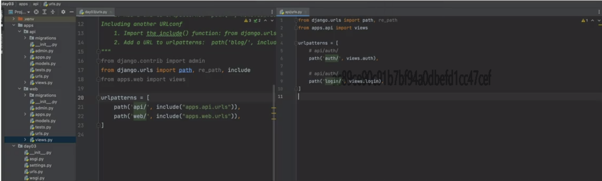

# Typore笔记操作手册

## 标题的操作

\# 一级标题 或者快捷键Ctrl+1

\## 二级标题 或者快捷键Ctrl+2

\### 三级标题 或者快捷键Ctrl+3

\#### 四级标题 或者快捷键Ctrl+4

\##### 五阶标题 或者快捷键Ctrl+5

\######六阶标题 或者快捷键Ctrl+6

子标题：使用星号或者使用加号。 eg：* 小标题 或者+ 小标题

还可以按tab键编写子子标题 如果想退出子标题编写 连续按enter键即可

## 字体操作

- 颜色

\1\

- 大小

\1\

- 背景颜色

\<table>\<tr>\<td bgcolor=#D1EEEE>背景色的设置是按照十六进制颜色值：#D1EEEE\</td>\</tr>\</table>

- 字体加粗

​         \**字体**

- 倾斜

​	\*字体*

- 字体加粗倾斜

​	\***字体***

- 字体删除线

​	\~~字体~~

- 引用使用格式

​	> 引用的句子(>+空格+被引用的句子的含义)

- 分割线使用格式

​	***或者---

## 插入图片

感叹号 + [里面的内容] +(地址)

~~~python

~~~

